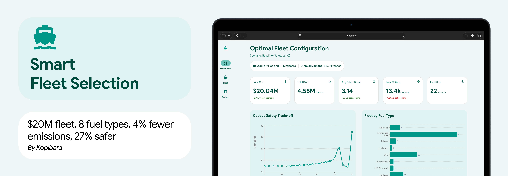

<p align="center">
  
</p>

# Intelligent Fleet Selection

**Live demo:** https://kopi-marihack26.netlify.app/

A React dashboard built for the 2026 Maritime Hackathon. It presents the results of a multi-objective fleet selection optimisation model for the route **Port Hedland → Singapore** (55M tonnes annual demand), with interactive charts covering cost, emissions, safety, and scenario analysis.

## Features

- **KPI summary** — total cost, total DWT, average safety score, CO2 emissions, fleet size
- **Pareto efficiency frontier** — cost vs safety trade-off across 21 optimisation runs
- **Fuel composition breakdown** — vessel count and emissions by fuel type
- **Shapley value analysis** — game-theoretic ranking of each vessel's contribution to fleet value
- **Carbon sensitivity** — total cost impact at varying carbon prices ($40–$160/tonne)
- **Sensitivity heatmap** — joint effect of carbon price and safety threshold on fleet cost
- **Scenario comparison table** — baseline (safety ≥ 3.0) vs sensitivity (safety ≥ 4.0) metrics
- **MCMC robustness score** — proportion of vessels classified as essential across posterior samples
- **Fleet table** — full vessel list with type, DWT, fuel, safety score, cost, and CO2

## Tech Stack

| Layer | Library |
|---|---|
| Framework | React 19 + TypeScript |
| Build | Vite |
| UI | Material UI v7 |
| Charts | Recharts |
| Deploy | Netlify |

## Getting Started

**Prerequisites:** Node 20+, [Bun](https://bun.sh)

```bash
# Install dependencies
bun install

# Start dev server
bun run dev

# Build for production
bun run build
```

The dev server runs at `http://localhost:5173` by default.

## Mock Data

All data is mock-generated for demonstration. To regenerate:

```bash
python3 generate_mock_data.py
```

This writes 8 JSON files to `src/data/`, covering fleet results, Pareto frontier, Shapley values, MCMC robustness, fuel summaries, carbon sensitivity, and the sensitivity heatmap.

## Project Structure

```
src/
  components/     # UI components (charts, tables, KPI cards, layout)
  data/           # Generated JSON data files
  App.tsx         # Root layout and data wiring
generate_mock_data.py  # Mock data generator
```

## Deployment

The project deploys to Netlify automatically on push. Configuration is in `netlify.toml`. The build command is `bun run build` and the publish directory is `dist`.